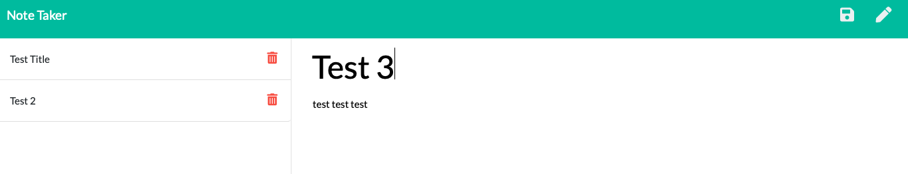
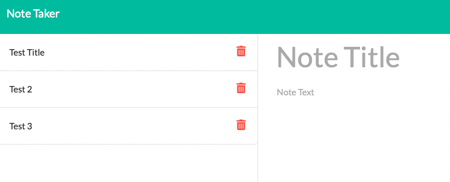
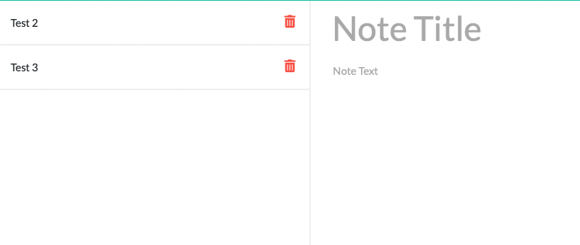

# Note-Taker

## Table of contents
 * [General info](#General-Info)
 * [Specifics](#Specifics)
 * [Deployment of application](#Deployment-of-application)
 * [Screenshots](#Screenshots)
 * [Application Code](#Application-Code)
 * [Comments](#Comments)

# General Info
 
 Application was design to create and save notes. 

# Specifics

  Connection between front end and back end was successfully created using Express.js. User can create new notes, save them, and delete if needed. If user close the application completely and reopen it later on all saved notes will be there. Application uses localhost port 3000. Application was deployed using Heroku. Link is down below under [Deployment of application](#Deployment-of-application).

# Deployment of application

 To run a project, please follow the link [https://sheymanidze.herokuapp.com/](https://sheymanidze.herokuapp.com/)

# Screenshots

 Creating new note

 

 Saved new note 

 

 One of the note deleted

 

# Application Code

  To view application code, please follow the link  [https://github.com/sheymanidze/Note-Taker](https://github.com/sheymanidze/Note-Taker)

# Comments

 Application has some glitches on the front end. If you click “create a new note” icon on the right corner won’t let you to type in unless you refresh the page. It is happening if you click “create new note” after you clicked to view existing savings. The app itself sometimes slower than you expected due to localhost connection, and it takes time to react on your clicks. Overall Note Taker application very useful tool to create, save and delete notes.
  